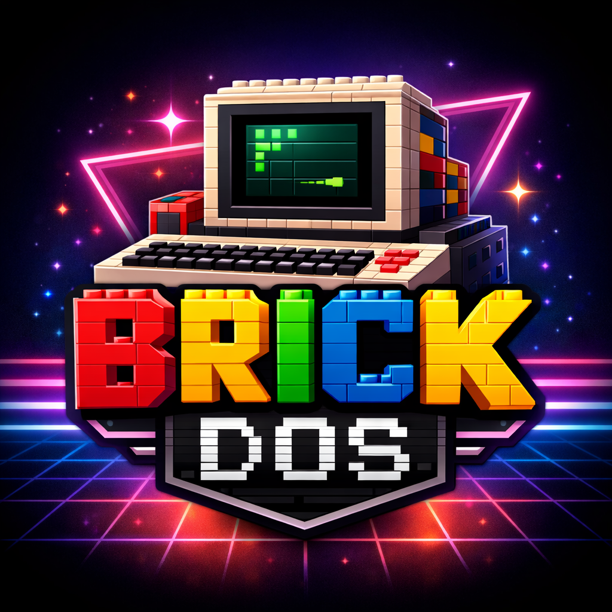

# BrickDOS



BrickDOS is a real retro-gaming PC built inside the **Pantasy Retro 90s PC 85005** brick model.

The original display area contains a **Raspberry Pi 5**, a 6.4-inch **AUO G064XAN01.0** XGA panel and the required controller and power electronics. The system runs **Raspberry Pi OS (64-bit)** as its technical base while presenting a deliberately simple, DOS-inspired interface for launching classic games through **DOSBox-X** and **ScummVM**.

This repository contains the technical core of the project: menu scripts, example launchers, configuration examples, hardware information and setup notes. **No commercial games, ROMs, disk images or other copyrighted game data are included.**

For photos, background information, the complete build story and a more detailed presentation of the project, visit:

**https://brickdos.net**

## How it works

BrickDOS boots into a fullscreen text-based menu. Each menu consists of a shell script and a matching text file:

```text
menu.sh
  ↓
displays menu.txt
  ↓
keypress
  ↓
game.sh
  ├── DOSBox-X → gameDOS.conf
  └── ScummVM  → gameSCUMM.sh
```

The repository contains the complete menu structure together with a small number of launcher examples so that the basic workflow can be understood without distributing any game files.

## Repository contents

- [`menu/`](menu/) – ASCII menus and the corresponding shell scripts
- [`examples/`](examples/) – example launch scripts for DOSBox-X and ScummVM
- [`docs/Installation.md`](docs/Installation.md) – system setup and installation notes
- [`docs/BrickDOS_GameMapping.csv`](docs/BrickDOS_GameMapping.csv) – mapping between game titles and launcher scripts
- [`docs/BoM.md`](docs/BoM.md) – bill of materials for the finished system
- [`assets/BrickDOS.png`](assets/BrickDOS.png) – BrickDOS logo

## Software stack

- Raspberry Pi OS (64-bit)
- X11 / Openbox
- xterm
- DOSBox-X
- ScummVM
- FluidSynth

Linux remains the technical foundation of the system, but the normal desktop is intentionally hidden during regular use. BrickDOS is designed to boot directly into its retro-style interface and launch games from there.

## Hardware

The finished build is based around a **Raspberry Pi 5 with 8 GB RAM** and a **128 GB microSD card**. The original brick-built monitor houses the computer, display controller and most of the supporting electronics. A detailed component list is available in the [Bill of Materials](docs/BoM.md).

## Notes

The files in this repository document the configuration used for the finished BrickDOS build. They are primarily intended as a technical reference and as an example for similar projects rather than as a one-click installer.

Game-specific DOSBox configurations are not included apart from the small examples required to demonstrate the launch process.

## Project website

More information about BrickDOS, including the hardware conversion, software design, photos and development history:

**https://brickdos.net**
